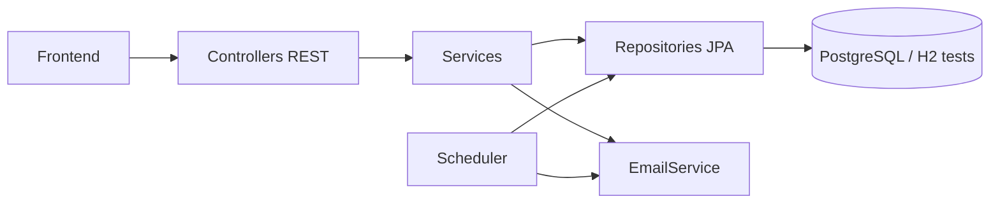
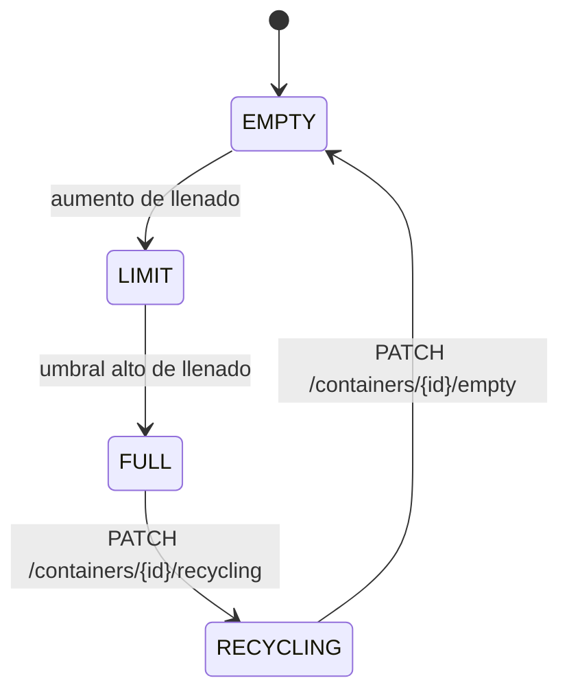
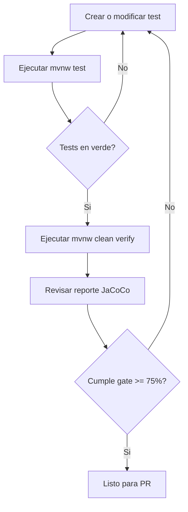
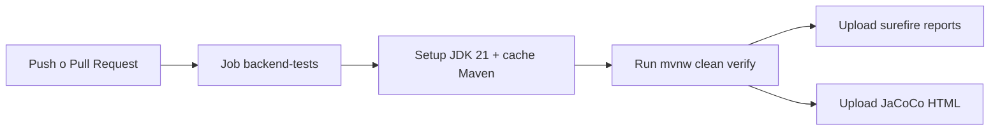

# EcoAula Backend

API REST para gestion de residuos en centros escolares.


## Indice

- [Resumen](#resumen)
- [Arquitectura](#arquitectura)
- [Tecnologias](#tecnologias)
- [Dominio](#dominio)
- [API principal](#api-principal)
- [Arranque local](#arranque-local)
- [Despliegue](#despliegue)
- [Testing y cobertura](#testing-y-cobertura)
- [Workflows de testing](#workflows-de-testing)
- [Estructura del repo](#estructura-del-repo)
- [Roadmap de calidad](#roadmap-de-calidad)

## Resumen

EcoAula permite:

- Registrar residuos por categoria.
- Actualizar estado de contenedores por porcentaje de llenado.
- Consultar estado y resumen de contenedores.
- Notificar por correo cambios importantes de estado.
- Ejecutar pruebas backend con H2 en memoria y control de cobertura con JaCoCo.

## Arquitectura



## Tecnologias

| Capa | Stack |
| --- | --- |
| Lenguaje | Java 21 |
| Framework | Spring Boot 3.5.x |
| Persistencia | Spring Data JPA + Hibernate |
| Base de datos | PostgreSQL (dev/prod), H2 (tests) |
| Tests | JUnit 5, Mockito, MockMvc |
| Calidad | JaCoCo (umbral minimo 75% instrucciones) |

## Dominio

Categorias de residuo (`Category`):

- `PLASTIC`
- `GLASS`
- `CARDBOARD`
- `ORGANIC`
- `PAPER`
- `METAL`

Estados de contenedor (`State`):

- `EMPTY`
- `LIMIT`
- `FULL`
- `RECYCLING`

Flujo esperado de estados:



## API principal

Base URL local: `http://localhost:8080`

| Recurso | Endpoint | Metodo | Respuesta esperada |
| --- | --- | --- | --- |
| Usuarios | `/api/v1/users` | `POST` | `201` |
| Usuarios | `/api/v1/users/{id}` | `GET` | `200` |
| Usuarios | `/api/v1/users/{id}` | `PUT` | `200` |
| Usuarios | `/api/v1/users/{id}` | `DELETE` | `204` |
| Residuos | `/api/v1/wastes` | `POST` | `201` |
| Residuos | `/api/v1/wastes/{id}` | `PUT` | `200` |
| Residuos | `/api/v1/wastes/{id}` | `DELETE` | `204` |
| Contenedores | `/api/v1/containers/{id}/fill` | `PUT` | `200` |
| Contenedores | `/api/v1/containers/{id}/status` | `GET` | `200` |
| Contenedores | `/api/v1/containers/summary` | `GET` | `200` o `204` |
| Contenedores | `/api/v1/containers/volume-by-category` | `GET` | `200` o `204` |
| Contenedores | `/api/v1/containers/{id}/recycling` | `PATCH` | `204` |
| Contenedores | `/api/v1/containers/{id}/empty` | `PATCH` | `204` |
| Health | `/api/v1/health` | `GET` | `200` |

Formato de error estandar (`4xx/5xx`):

```json
{
  "timestamp": "2026-02-20T01:00:00Z",
  "status": 404,
  "error": "Not Found",
  "message": "Usuario no encontrado",
  "path": "/api/v1/users/77"
}
```

## Arranque local

### 1. Prerrequisitos

- JDK 21
- Maven Wrapper (`mvnw` / `mvnw.cmd`)
- PostgreSQL para ejecucion en perfil `dev`

### 2. Variables de entorno

Perfiles disponibles:

- `dev` (default): PostgreSQL local + mail local
- `prod`: PostgreSQL y SMTP por variables de entorno
- `demo`: H2 en archivo local para demo rapida

Variables principales:

- `DB_HOST`
- `DB_NAME`
- `USER_NAME`
- `USER_PASSWORD`
- `USER_MAIL` (opcional, email remitente)
- `FRONTEND_URL` (opcional, origen permitido para CORS)
- `SPRING_PROFILES_ACTIVE` (`dev`, `prod`, `demo`)
- `APP_MAIL_ENABLED` (`true` o `false`)

Ejemplo rapido (`.env` local, no versionado):

```dotenv
DB_HOST=localhost
DB_NAME=ecoaula
USER_NAME=postgres
USER_PASSWORD=postgres
USER_MAIL=no-reply@ecoaula.local
FRONTEND_URL=http://localhost:5173
SPRING_PROFILES_ACTIVE=dev
APP_MAIL_ENABLED=true
```

Puedes tomar como base:

- `.env.example`

### 3. Ejecutar backend

Windows:

```bash
.\mvnw.cmd spring-boot:run
```

Linux/macOS:

```bash
./mvnw spring-boot:run
```

## Despliegue

### Produccion (recomendado)

Configura estas variables en la plataforma de despliegue:

- `SPRING_PROFILES_ACTIVE=prod`
- `SPRING_DATASOURCE_URL`
- `SPRING_DATASOURCE_USERNAME`
- `SPRING_DATASOURCE_PASSWORD`
- `FRONTEND_URL` (puede ser lista separada por comas)
- `APP_MAIL_ENABLED` (`false` si no tienes SMTP configurado)
- `SMTP_HOST`, `SMTP_PORT`, `SMTP_USERNAME`, `SMTP_PASSWORD` (si correo activo)

### Endpoint de verificacion publica

Cuando despliegues, usa este endpoint para comprobar que la API esta viva:

- `GET {BACKEND_PUBLIC_URL}/api/v1/health`

## Testing y cobertura

### Comandos utiles

Windows:

```bash
.\mvnw.cmd test
.\mvnw.cmd clean verify
```

Linux/macOS:

```bash
./mvnw test
./mvnw clean verify
```

### Snapshot real de cobertura

Medido el **20-02-2026** con `mvnw clean verify`:

| Metrica JaCoCo | Cobertura |
| --- | --- |
| Instrucciones | `87.36%` |
| Branches | `81.18%` |
| Lineas | `86.48%` |
| Complejidad | `84.66%` |
| Metodos | `89.39%` |
| Clases | `96.30%` |

Datos adicionales del mismo run:

- `91` tests ejecutados
- `0` fallos
- Gate de calidad activo en `pom.xml`: `INSTRUCTION >= 75%`

Reporte HTML local:

- `target/site/jacoco/index.html`

Guia detallada de testing:

- `docs/backend-testing.md`

## Workflows de testing

### Flujo local rapido



### Flujo CI (GitHub Actions)

Archivo: `.github/workflows/backend-tests.yml`



## Estructura del repo

```text
.
|-- docs/
|   `-- backend-testing.md
|-- scripts/
|   `-- verify-alerts.ps1
|-- src/main/java/com/java/ecoaula/
|   |-- config/
|   |-- controller/
|   |-- dto/
|   |-- entity/
|   |-- exception/
|   |-- repository/
|   |-- scheduler/
|   `-- service/
|-- src/test/java/com/java/ecoaula/
|   |-- controller/
|   |-- dto/
|   |-- entity/
|   |-- exception/
|   |-- service/
|   `-- config/
`-- pom.xml
```

## Roadmap de calidad

- Rehabilitar tests `@DataJpaTest` hoy comentados para reforzar repositorios.
- Cubrir rutas faltantes en `ContainerController` y `ContainerServiceImpl`.
- Testear `ContainerReminderScheduler` con doubles de repositorio/email.
- Sustituir snapshot manual de cobertura por badge dinamico en CI cuando el repo este en GitHub.
