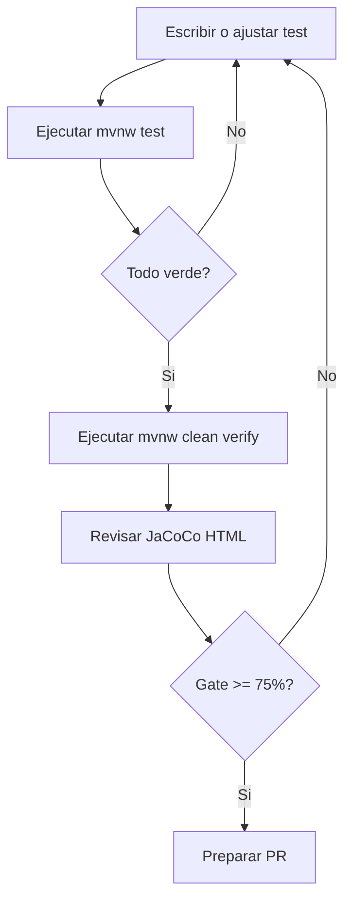
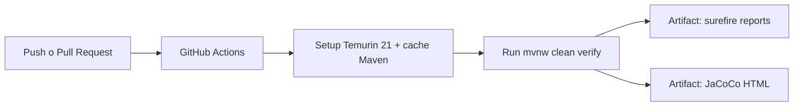

# Documentacion de testing backend

## Estado real (verificado)

Ultima verificacion manual: **20-02-2026**

Comando ejecutado:

```bash
mvnw clean verify
```

Resultado:

- Build: `SUCCESS`
- Tests totales: `90`
- Fallos: `0`
- Errores: `0`
- Suites ejecutadas: `20`
- Gate JaCoCo activo: `INSTRUCTION >= 75%`

Este documento reemplaza versiones antiguas que indicaban cobertura `100%`.

## Objetivo de esta guia

- Explicar como se prueba el backend hoy.
- Mostrar cobertura real y trazable.
- Definir workflow local y CI.
- Priorizar mejoras de cobertura sin inflar metricas.

## Estrategia de pruebas

El proyecto usa una estrategia por capas:

- Unit tests de servicios y dominio.
- Controller tests con MockMvc (`@WebMvcTest`).
- Integracion con contexto Spring (`@SpringBootTest`).
- End-to-end backend (MockMvc + repos reales + perfil `test`).

## Stack de testing

- JUnit 5
- Mockito
- Spring Boot Test
- MockMvc
- H2 en memoria (perfil `test`)
- JaCoCo para cobertura y quality gate

## Inventario actual de suites

| Tipo | Clases principales | Estado |
| --- | --- | --- |
| Unit - service | `ContainerServiceImplTest`, `EmailServiceImplTest`, `UserServiceImplTest`, `WasteServiceImplTest` | Activo |
| Unit - dominio | `CategoryTest`, `ContainerTest`, `StateTest`, `UserTest`, `WasteTest` | Activo |
| Unit - DTO/config/exception | `CategoryVolumeDTOTest`, `ContainerStatusDTOTest`, `UpdateFillDTOTest`, `WasteStatusDTOTest`, `DotenvConfigTest`, `ContainerNotFoundExceptionTest` | Activo |
| Controller slice | `ContainerControllerWebMvcTest`, `UserControllerWebMvcTest`, `WasteControllerWebMvcTest` | Activo |
| Integracion contexto | `EcoaulaApplicationTests`, `UserControllerTest` | Activo |
| End-to-end backend | `UserControllerIT` | Activo |
| Repository (`@DataJpaTest`) | `ContainerRepositoryDataJpaTest` | Inactivo (archivo comentado) |

## Entorno reproducible de tests

Archivo clave:

- `src/test/resources/application-test.properties`

Puntos importantes:

- Base de datos H2 en memoria: `jdbc:h2:mem:ecoaula_test`
- `spring.jpa.hibernate.ddl-auto=create-drop`
- Perfil de pruebas desacoplado de PostgreSQL
- Sin dependencia de variables `DB_*` para correr tests

## Cobertura actual (JaCoCo)

Snapshot del run de **20-02-2026**:

| Metrica | Cobertura |
| --- | --- |
| Instrucciones | `87.53%` |
| Branches | `83.54%` |
| Lineas | `87.07%` |
| Complejidad | `85.88%` |
| Metodos | `89.15%` |
| Clases | `96.15%` |

Reporte local:

- `target/site/jacoco/index.html`

## Hotspots de cobertura baja

Segun `target/site/jacoco/jacoco.csv`:

| Clase | Cobertura instrucciones | Observacion |
| --- | --- | --- |
| `ContainerSummaryDTO` | `0.00%` | DTO sin test dedicado |
| `ContainerController` | `59.72%` | Faltan mas casos para endpoints PATCH y errores de estado |
| `ContainerServiceImpl` | `61.90%` | Faltan ramas de negocio y errores |
| `ContainerReminderScheduler` | `61.76%` | Falta test directo del scheduler |
| `GlobalExceptionHandler` | `70.00%` | Faltan casos para ramas de error 500 y validaciones |

## Workflows de testing

### Workflow local



### Workflow CI

Archivo:

- `.github/workflows/backend-tests.yml`



## Comandos operativos

Windows:

```bash
.\mvnw.cmd test
.\mvnw.cmd clean verify
```

Linux/macOS:

```bash
./mvnw test
./mvnw clean verify
```

Script util para validar alertas por correo:

```bash
powershell -ExecutionPolicy Bypass -File .\scripts\verify-alerts.ps1
```

## Riesgos tecnicos detectados

- Se unificaron los umbrales de estado de contenedor a `70/90` (entidad y servicio). Conviene mantener este contrato en una unica fuente para evitar regresiones.
- La capa repository no tiene pruebas activas porque `ContainerRepositoryDataJpaTest` esta comentado.

## Plan de mejora propuesto (priorizado)

1. Reactivar `ContainerRepositoryDataJpaTest` y anadir casos de agregacion por categoria.
2. Subir cobertura de `ContainerController` con mas casos de transiciones PATCH invalidas.
3. Anadir tests unitarios directos de `ContainerReminderScheduler` con mocks de repo/email.
4. Anadir tests para `ContainerSummaryDTO` y ramas faltantes de `ContainerServiceImpl`.
5. Publicar badge dinamico de CI/cobertura cuando el repo este en GitHub.

## Criterio de calidad recomendado para PR

- Ningun test roto (`mvnw test`).
- `mvnw clean verify` en verde.
- No bajar de `75%` instrucciones (gate actual).
- Si se toca logica de negocio, incluir prueba nueva que cubra al menos una rama adicional.

